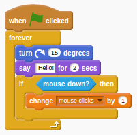

# Scratch Blocks Syntax 

In Creative Kids projects, Scratch blocks can be written by using ` ```blocks` and then writing a line of text for each block in Scratch.

For example

```blocks
when green flag clicked
forever
   turn cw (15) degrees
   say [Hello!] for (2) secs
   if <mouse down?> then
      change [mouse clicks v] by (1)
   end
```

Would display:



<sup>1</sup>Based upon https://wiki.scratch.mit.edu/wiki/Block_Plugin/Syntax
